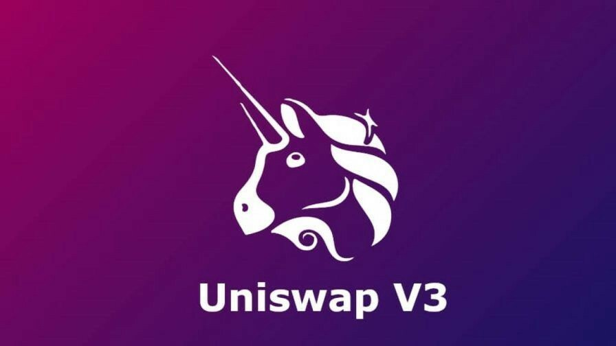

# Uniswap V3 Implements

If examples help you, leave a star.

## Get Pool Address

Get Pool any test networks or mainnet [click here](./get-pool-address-v3/)

## Swap Token

Swap WETH to UNI [click here](./swap-tokens-v3/)

 

Development by Jeftar Mascarenhas

